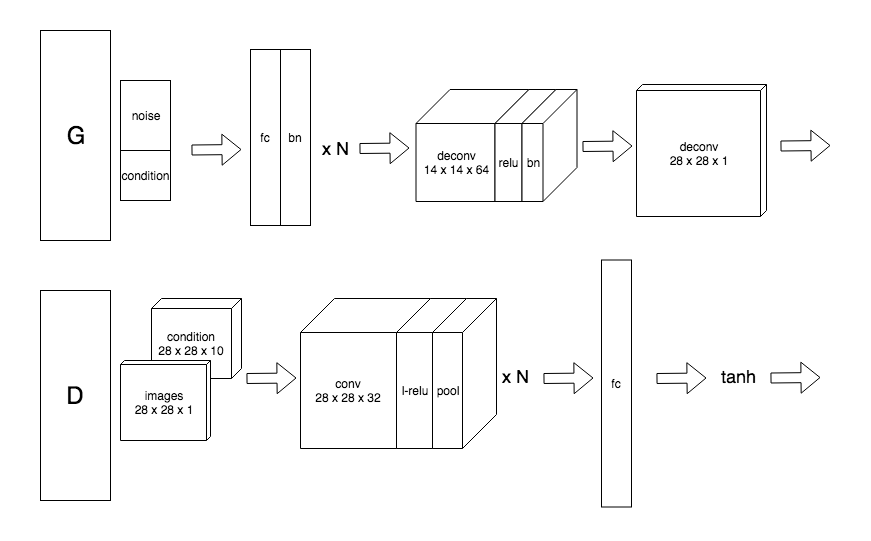

# C-GAN
conditional GAN implementation with tensorflow

# Architecture
C-GAN or conditional GAN introduces condition into the GAN architecture. With extra condition, we can somehow control our GAN to synthesize some expected results. There is an example of the CGAN architecture, and result images in `result-images` folder are generated by the CGAN with the following architecture.

# Startup
Run `model/main.py` directly to view the result. The definition of the CGAN can be observed at `model/c_gan.py`. Some useful functions are defined in `model/utils.py`. Also notice that either 'cnn' or 'dnn' is supported to represent this CGAN architecture. To simplify the code, saving or restoring the trained model is not supported.

# Results
The left figure shows the final result (trained with `epoch=5`,`minibatch_size=128`) of 'cnn', and the right correspond to the 'dnn' (`epoch=10`,`minibatch_size=128`)

It can be told that 'cnn' performs better. However, 'cnn' model takes much moooooooooooooore time than 'dnn' to be trained, especially using cpu only.

# Reference
+ [MNIST can be downloaded here](http://yann.lecun.com/exdb/mnist/)
+ [Generative Adversarial Networks](https://arxiv.org/abs/1406.2661)
+ [Conditional Generative Adversarial Nets](https://arxiv.org/abs/1411.1784)
